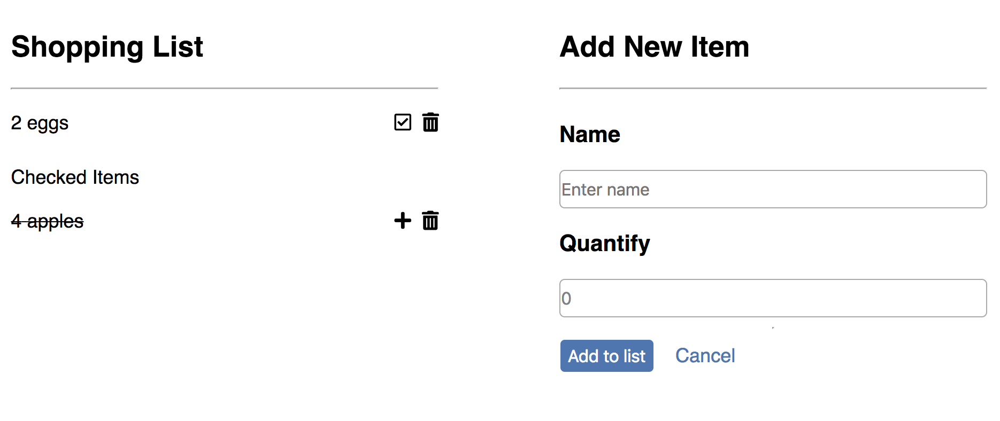

# Shopping List Project 

This is a shopping list project, created using React.

# App Functionality

The project shows
- items on the shopping list
- items checked from the list

Users will be able to 
- add a new item
- check items from the list 
- put items back to the list

# App Screenshot

# Installation Instructions
- clone my repo https://github.com/mavisluan/random-users.git
- install all project dependencies with yarn install
- start the development server with yarn start